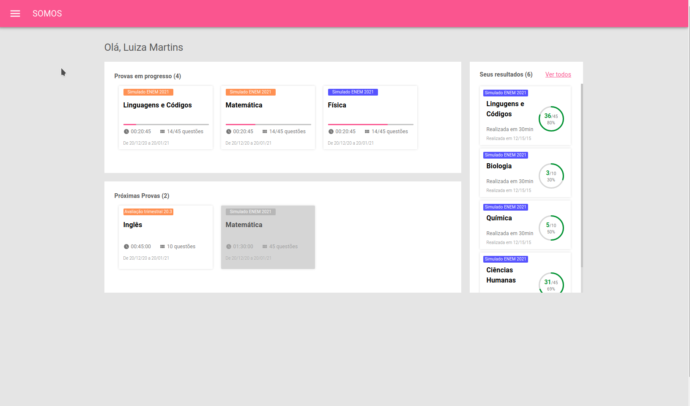
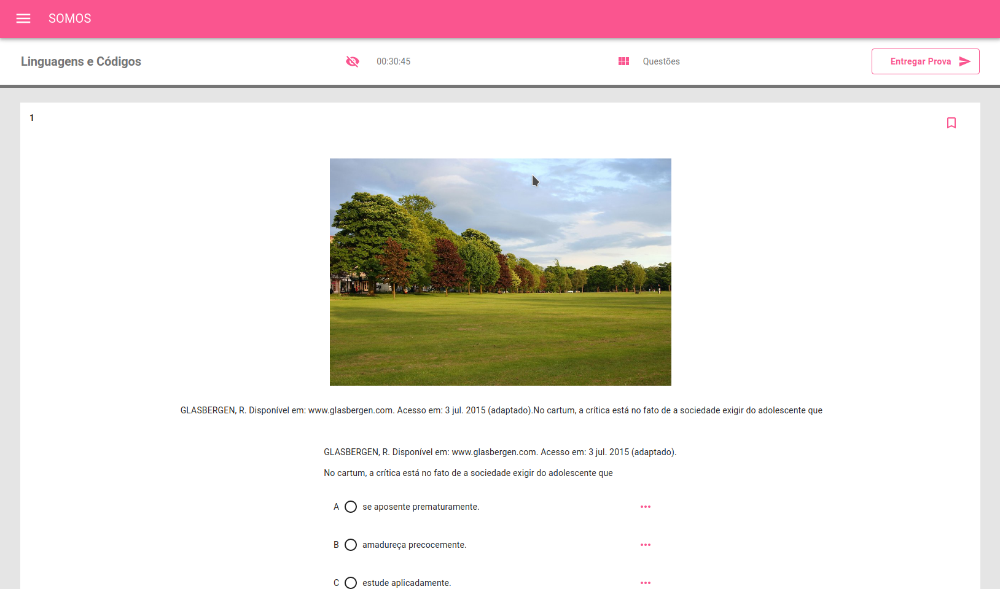
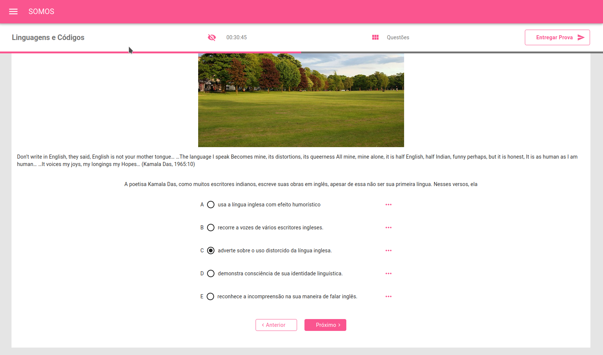

# Meritt Job Test

This project was bootstrapped with [Create React App](https://github.com/facebook/create-react-app).

## Details

This is a little application that consumes an api to get questions and answers of a exam.

## Tools

* 
* <b>:atom_symbol: -- React-JS</b>
* <b>:purple_heart: -- Material-UI</b>
* <b>:nail_care: -- Styled Components</b>

## Implementations

* <b>:high_brightness: -- Context-API</b>
* <b>:iphone: -- Responsivity</b>
* <b>:tada: -- Deployment</b>
* <b>:envelope_with_arrow: -- Api Consuming</b>
* <b>:anchor: -- Hooks</b>
* <b>:children_crossing: -- Routes</b>

## Usage

:rocket: You can visit the deployed version <a href="" rel="">Vercel Deployment</a>.

:octocat: Or just clone this repo and...

* Run yarn to install all the dependencies
* Run yarn start to executes the application
* You can consume a different api key just changing the REACT_APP_API_KEY
* If you prefer use the deployed api, you can use https://api-meritt-test.herokuapp.com/
* The api of application consumes the route /proofs

